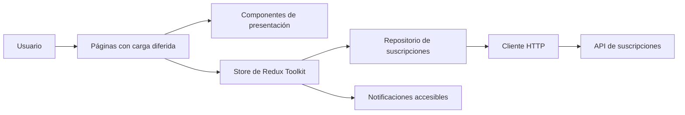

# Portal de Suscripciones

[English version](./README.md)

Frontend en React y TypeScript para la evaluación del sistema de suscripciones. Permite
autenticarse, consultar el estado de una suscripción, comparar planes, realizar un pago simulado y
revisar la bitácora administrativa de pagos.

## Funcionalidades

- Autenticación JWT con persistencia de sesión por pestaña
- Dashboard y página de planes protegidos
- Bitácora de pagos protegida por rol de administrador
- Checkout simulado e idempotente
- Datos del usuario autenticado autollenados durante el checkout
- Notificaciones accesibles y navegación responsiva
- Páginas cargadas bajo demanda y optimizaciones de renderizado

## Tecnologías

- Vite 8, React 19 y TypeScript 6
- React Router 7
- Redux Toolkit y React Redux
- Tailwind CSS 4 y styled-components
- Zod para validar el inicio de sesión
- Jest y Testing Library
- Playwright para el flujo E2E de suscripción
- GitHub Actions para pruebas unitarias, lint y typecheck

## Requisitos

- Node.js 22 o superior
- pnpm 11.6.0
- API de suscripciones ejecutándose en `http://localhost:3000`

## Instalación

```bash
corepack enable
corepack pnpm install
```

Crea el archivo de entorno local:

```bash
copy .env.example .env
```

En macOS o Linux usa `cp .env.example .env`. Después inicia la aplicación:

```bash
corepack pnpm dev
```

Abre `http://localhost:5173`. Durante el desarrollo local, Vite redirige las solicitudes de `/api`
a `http://localhost:3000`.

## Comandos

| Comando | Propósito |
| --- | --- |
| `corepack pnpm dev` | Inicia el servidor de desarrollo de Vite |
| `corepack pnpm build` | Valida tipos y genera el build de producción |
| `corepack pnpm preview` | Previsualiza el build de producción |
| `corepack pnpm typecheck` | Valida los tipos de TypeScript |
| `corepack pnpm lint` | Ejecuta ESLint |
| `corepack pnpm test` | Ejecuta pruebas unitarias y de componentes |
| `corepack pnpm test:watch` | Ejecuta Jest en modo interactivo |
| `corepack pnpm test:coverage` | Ejecuta Jest y valida la cobertura |
| `corepack pnpm test:e2e` | Ejecuta el flujo E2E con Playwright |

Instala Chromium una vez antes de ejecutar las pruebas E2E:

```bash
corepack pnpm exec playwright install chromium
```

## Variables de Entorno

| Variable | Valor predeterminado | Propósito |
| --- | --- | --- |
| `VITE_API_URL` | `/api/v1` | Ruta base de la API utilizada por el navegador |
| `VITE_API_PROXY_TARGET` | `http://localhost:3000` | Destino del proxy local de Vite |

Si la API está hospedada por separado, configura `VITE_API_URL` con su URL pública y permite el
origen del frontend en la configuración CORS del servidor.

## Rutas

| Ruta | Acceso | Propósito |
| --- | --- | --- |
| `/login` | Público | Autenticar al usuario |
| `/` | Usuario autenticado | Consultar la suscripción actual |
| `/plans` | Usuario autenticado | Comparar planes y completar el checkout |
| `/admin/payment-logs` | Administrador | Buscar y paginar la actividad de pagos |

Las rutas desconocidas muestran la página de recurso no encontrado.

## Arquitectura



### Responsabilidades

- `pages/` compone los flujos correspondientes a cada ruta.
- `features/` contiene presentación y ciclos de vida específicos del dominio.
- `components/` contiene elementos de interfaz reutilizables y accesibles.
- `store/` administra autenticación, suscripciones, checkout y notificaciones.
- `services/subscriptionRepository.ts` define las operaciones del backend utilizadas por el cliente.
- `services/apiClient.ts` administra headers, tiempos de espera, reintentos y errores HTTP.
- `lib/sessionStorage.ts` administra el ciclo de vida de la sesión JWT en la pestaña actual.

## Contrato de la API

El cliente utiliza los siguientes endpoints:

- `POST /api/v1/auth/login`
- `GET /api/v1/plans?page=1&limit=20`
- `GET /api/v1/subscriptions?page=1&limit=20`
- `POST /api/v1/subscriptions/checkout`
- `GET /api/v1/payments?page={page}&limit={limit}` para administradores
- `GET /api/v1/subscriptions?page=1&limit=100` para relacionar pagos y suscripciones

Las solicitudes protegidas envían `Authorization: Bearer <jwt>`. El checkout también incluye un
`Idempotency-Key` único y el siguiente body:

```json
{
  "planId": "plan-id",
  "paymentMethod": "simulated-card"
}
```

### Identidad Durante el Checkout

El nombre y correo se autocompletan con los datos del usuario autenticado y se muestran como campos
de confirmación de solo lectura. No se envían en el body del checkout porque la API obtiene la
identidad del comprador desde el JWT firmado. Esto evita confiar en datos editables del cliente que
podrían utilizarse para suplantar a otro usuario.

## Resiliencia

- Los errores de red y respuestas `5xx` se reintentan dos veces con espera exponencial.
- Las solicitudes expiran después de ocho segundos.
- Los errores de validación, autenticación, autorización, pago, conflicto, timeout, red y servidor
  muestran mensajes diferentes.
- Una respuesta `401` elimina la sesión actual y solicita una nueva autenticación.
- El checkout deshabilita el envío mientras procesa el pago.
- Cada checkout utiliza una clave de idempotencia para prevenir procesamiento duplicado.
- Un pago exitoso actualiza la suscripción y genera una notificación accesible.

El backend actualmente no expone WebSocket ni SSE. La actualización posterior al pago consiste en
una confirmación inmediata del cliente seguida por una nueva consulta de la suscripción.

## Pruebas

Jest recopila cobertura de todo el código fuente de la aplicación y exige un mínimo global de 70%
para ramas, funciones, líneas y sentencias. La suite cubre autenticación, almacenamiento, errores de
API, repositorios, transiciones de Redux, rutas, páginas, componentes reutilizables, checkout y
comportamiento de renderizado.

Playwright simula únicamente el límite de red y verifica que un usuario pueda:

1. Iniciar sesión.
2. Abrir la página de planes.
3. Seleccionar un plan.
4. Confirmar los datos de cuenta autollenados.
5. Completar un pago simulado.
6. Ver la confirmación del pago y activación.

## Integración Continua

El workflow `.github/workflows/ci.yml` se ejecuta en pull requests y pushes a `main`. Utiliza
Node.js 22, pnpm 11.6.0, el lockfile congelado y caché de pnpm para ejecutar:

- Pruebas unitarias y de componentes
- ESLint
- Validación de tipos de TypeScript

## Accesibilidad y Renderizado

- Navegación semántica, labels, errores de campos, diálogos y región de notificaciones `aria-live`
- Estilos de foco y cierre del checkout con la tecla Escape
- Navegación móvil y cuadrícula de planes responsivas
- Soporte para movimiento reducido
- División de código por ruta con `React.lazy`
- Selectores específicos de Redux para evitar renders por estado no relacionado
- Tarjetas de planes memorizadas y callbacks estables para el checkout
- Filtrado memorizado en la tabla administrativa de pagos

## Consideraciones de Producción

- Publicar el build de Vite detrás de TLS.
- Configurar CORS para aceptar únicamente el origen del frontend cuando la API esté separada.
- Preferir una cookie HttpOnly de refresh con access tokens de corta duración.
- Añadir el build de producción y Playwright al CI antes de desplegar.
- Un canal SSE o WebSocket puede alimentar posteriormente el estado de notificaciones existente.
