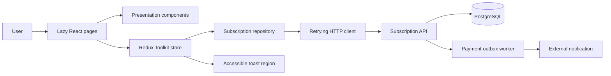

# Subscription Portal

React and TypeScript frontend for the scalable subscription system assessment. Users can authenticate, view subscription status, compare plans, and complete a simulated, idempotent checkout.

## Stack

- Vite 8, React 19, and TypeScript
- React Router with lazy-loaded protected routes
- Redux Toolkit for auth, subscription, checkout, and notification state
- Tailwind CSS for layout and styled-components for reusable custom controls
- Jest and Testing Library for unit coverage
- Playwright for the complete subscription E2E flow

## Requirements

- Node.js 22 or newer
- pnpm 11 (`corepack enable pnpm`)
- Subscription API running at `http://localhost:3000`

## Setup

```bash
corepack pnpm install
copy .env.example .env
corepack pnpm dev
```

Open `http://localhost:5173`. Vite proxies `/api` requests to `http://localhost:3000`, avoiding a local CORS dependency.

## Commands

```bash
corepack pnpm dev
corepack pnpm build
corepack pnpm typecheck
corepack pnpm lint
corepack pnpm test
corepack pnpm test:coverage
corepack pnpm test:e2e
```

Install the Playwright browser once before the first E2E run:

```bash
corepack pnpm exec playwright install chromium
```

## Environment

| Variable | Default | Purpose |
| --- | --- | --- |
| `VITE_API_URL` | `/api/v1` | API path used by the browser |
| `VITE_API_PROXY_TARGET` | `http://localhost:3000` | Local Vite proxy target |

For a separately hosted production API, set `VITE_API_URL` to its public URL and allow the frontend origin in the API CORS policy.

## Architecture



### Responsibilities

- `pages/` composes route-level presentation and user workflows.
- `components/` contains reusable accessible UI.
- `store/` owns application state and async workflow transitions.
- `services/subscriptionRepository.ts` expresses backend operations without UI concerns.
- `services/apiClient.ts` owns authentication headers, timeouts, retries, and error mapping.
- `lib/sessionStorage.ts` owns tab-scoped JWT session lifecycle.

## Backend Contract

The portal integrates with:

- `POST /api/v1/auth/login`
- `GET /api/v1/plans`
- `GET /api/v1/subscriptions`
- `POST /api/v1/subscriptions/checkout`

Protected calls send `Authorization: Bearer <jwt>`. Checkout also sends a unique `Idempotency-Key`, which makes automatic retry safe and protects against duplicate clicks or transient network failures.

### Checkout identity and payment data

The checkout visibly covers the assessment's name, email, and payment requirement:

- Name and email are automatically filled from the authenticated user returned at login.
- Both identity fields are read-only confirmation data. They are not included in the checkout body because the API derives the purchaser from the signed JWT.
- The selected simulated payment method is submitted with the plan identifier as `{ planId, paymentMethod }`.

This avoids trusting client-supplied identity fields that could be modified to impersonate another
user, while still making the account receiving the subscription clear before payment.

## Resilience and Edge Cases

- Network and 5xx failures retry twice with exponential backoff.
- Requests time out after eight seconds and produce a specific message.
- Validation, authentication, timeout, network, and server errors have distinct user feedback.
- A `401` clears the tab-scoped session and requests a new login; `403` remains an access-denied error.
- Checkout disables submission while processing.
- The dashboard keeps a useful fallback message when refresh fails.
- Payment success produces an immediate accessible notification and refreshes subscription state.

The current backend does not expose WebSocket or SSE events. "Live updates" therefore reflect immediate client-side checkout confirmation. A production real-time channel can feed the same notification slice without changing page components.

## Testing

Jest enforces at least 70% global coverage across session, API, repository, and Redux business logic. The current suite covers successful and failed session handling, HTTP error mapping, auth expiry, idempotent checkout, repository mapping, and Redux transitions.

Playwright mocks only the network boundary and verifies the user-visible flow:

1. Sign in.
2. Open available plans.
3. Select a plan.
4. Submit simulated payment.
5. See payment and activation confirmation.

## Accessibility and Performance

- Semantic navigation, labels, field errors, dialog roles, and an `aria-live` notification region
- Visible keyboard focus and Escape-to-close checkout
- Responsive mobile navigation and plan layout
- Reduced-motion support
- Route-level code splitting with `React.lazy`
- Narrow Redux selectors and local form state to limit unrelated renders

## Production Notes

- Serve the Vite build from a CDN behind TLS.
- Configure strict frontend-origin CORS on the API when not using a same-origin reverse proxy.
- Prefer an HttpOnly refresh cookie with short-lived access tokens.
- Send payment events to Kafka or RabbitMQ and deliver real-time updates through SSE/WebSockets.
- Run typecheck, lint, unit coverage, build, and Playwright in CI before deployment.
