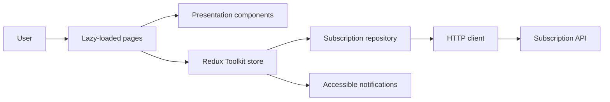

# Subscription Portal

[Versión en español](./README.es.md)

React and TypeScript frontend for the subscription system assessment. It supports authentication,
subscription status, plan comparison, simulated checkout, and an administrative payment log.

## Features

- JWT authentication with tab-scoped session persistence
- Protected dashboard and plans routes
- Role-protected payment log for administrators
- Simulated, idempotent subscription checkout
- Authenticated user details prefilled during checkout
- Accessible notifications and responsive navigation
- Lazy-loaded route pages and render-focused component optimizations

## Stack

- Vite 8, React 19, and TypeScript 6
- React Router 7
- Redux Toolkit and React Redux
- Tailwind CSS 4 and styled-components
- Zod for login validation
- Jest and Testing Library
- Playwright for the subscription E2E flow
- GitHub Actions for unit tests, lint, and typecheck

## Requirements

- Node.js 22 or newer
- pnpm 11.6.0
- Subscription API running at `http://localhost:3000`

## Setup

```bash
corepack enable
corepack pnpm install
```

Create the local environment file:

```bash
copy .env.example .env
```

Use `cp .env.example .env` on macOS or Linux. Then start the application:

```bash
corepack pnpm dev
```

Open `http://localhost:5173`. During local development, Vite proxies `/api` to
`http://localhost:3000`.

## Commands

| Command | Purpose |
| --- | --- |
| `corepack pnpm dev` | Start the Vite development server |
| `corepack pnpm build` | Typecheck and create the production build |
| `corepack pnpm preview` | Preview the production build |
| `corepack pnpm typecheck` | Validate TypeScript types |
| `corepack pnpm lint` | Run ESLint |
| `corepack pnpm test` | Run unit and component tests |
| `corepack pnpm test:watch` | Run Jest in watch mode |
| `corepack pnpm test:coverage` | Run Jest with coverage thresholds |
| `corepack pnpm test:e2e` | Run the Playwright E2E flow |

Install Chromium once before the first E2E run:

```bash
corepack pnpm exec playwright install chromium
```

## Environment

| Variable | Default | Purpose |
| --- | --- | --- |
| `VITE_API_URL` | `/api/v1` | API base path used by the browser |
| `VITE_API_PROXY_TARGET` | `http://localhost:3000` | Local Vite proxy target |

For a separately hosted API, set `VITE_API_URL` to its public URL and configure the API to allow
the frontend origin.

## Routes

| Route | Access | Purpose |
| --- | --- | --- |
| `/login` | Public | Authenticate the user |
| `/` | Authenticated | View the current subscription |
| `/plans` | Authenticated | Compare plans and complete checkout |
| `/admin/payment-logs` | Administrator | Search and paginate payment activity |

Unknown routes render the not-found page.

## Architecture



### Responsibilities

- `pages/` composes route-level workflows.
- `features/` contains domain-specific presentation and lifecycle components.
- `components/` contains reusable and accessible UI.
- `store/` owns authentication, subscription, checkout, and notification state.
- `services/subscriptionRepository.ts` defines the backend operations used by the client.
- `services/apiClient.ts` owns headers, timeouts, retries, and HTTP error mapping.
- `lib/sessionStorage.ts` owns the JWT session lifecycle for the current browser tab.

## API Contract

The client integrates with:

- `POST /api/v1/auth/login`
- `GET /api/v1/plans?page=1&limit=20`
- `GET /api/v1/subscriptions?page=1&limit=20`
- `POST /api/v1/subscriptions/checkout`
- `GET /api/v1/payments?page={page}&limit={limit}` for administrators
- `GET /api/v1/subscriptions?page=1&limit=100` for the administrator payment lookup

Protected requests send `Authorization: Bearer <jwt>`. Checkout also sends a unique
`Idempotency-Key` and the body:

```json
{
  "planId": "plan-id",
  "paymentMethod": "simulated-card"
}
```

### Checkout Identity

Name and email are prefilled from the authenticated user and displayed as read-only confirmation
fields. They are not sent in the checkout body because the API derives the purchaser from the
signed JWT. This prevents client-supplied identity data from being used to impersonate another
user.

## Resilience

- Network failures and `5xx` responses retry twice with exponential backoff.
- Requests time out after eight seconds.
- Validation, authentication, authorization, payment, conflict, timeout, network, and server
  errors have distinct feedback.
- A `401` clears the current session and redirects the user to authenticate again.
- Checkout submission is disabled while the payment is processing.
- Every checkout request uses an idempotency key to prevent duplicate processing.
- A successful payment refreshes subscription state and produces an accessible notification.

The backend currently exposes no WebSocket or SSE channel. Updates after payment are immediate
client-side confirmation followed by a subscription refresh.

## Testing

Jest collects coverage across the application source and enforces a global minimum of 70% for
branches, functions, lines, and statements. The suite covers authentication, storage, API error
mapping, repositories, Redux transitions, routes, pages, reusable components, checkout, and
rendering behavior.

Playwright mocks only the API boundary and verifies that a user can:

1. Sign in.
2. Open the plans page.
3. Select a plan.
4. Confirm the prefilled account details.
5. Complete a simulated payment.
6. See activation and payment confirmation.

## CI

The workflow at `.github/workflows/ci.yml` runs on pull requests and pushes to `main`. It uses
Node.js 22, pnpm 11.6.0, a frozen lockfile, and pnpm caching to execute:

- Unit and component tests
- ESLint
- TypeScript typecheck

## Accessibility and Rendering

- Semantic navigation, labels, field errors, dialog roles, and an `aria-live` notification region
- Keyboard focus styles and Escape-to-close checkout behavior
- Responsive mobile navigation and plan layout
- Reduced-motion support
- Route-level code splitting with `React.lazy`
- Narrow Redux selectors to avoid renders caused by unrelated state
- Memoized plan cards and stable checkout callbacks
- Memoized filtering for the administrative payment table

## Production Notes

- Serve the Vite build behind TLS.
- Configure strict frontend-origin CORS when the API is hosted separately.
- Prefer an HttpOnly refresh cookie with short-lived access tokens.
- Add production build and Playwright jobs to CI before deployment.
- A real-time SSE or WebSocket channel can later feed the existing notification state.
